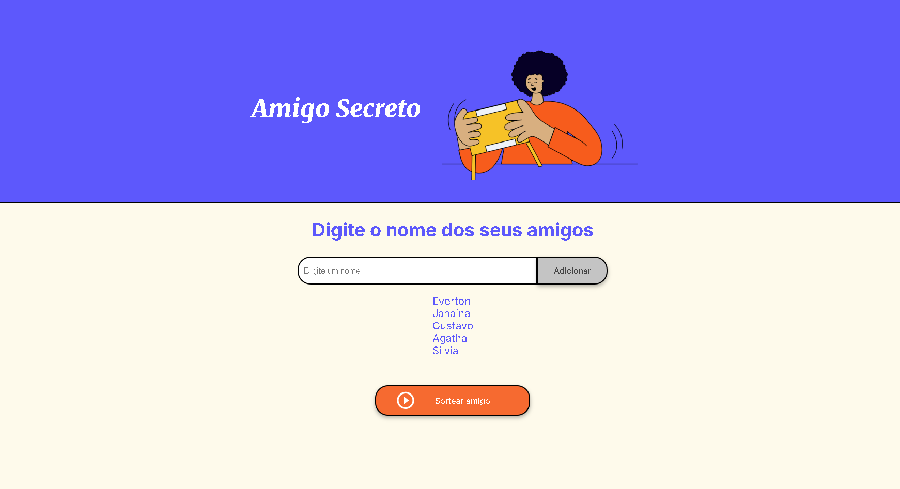
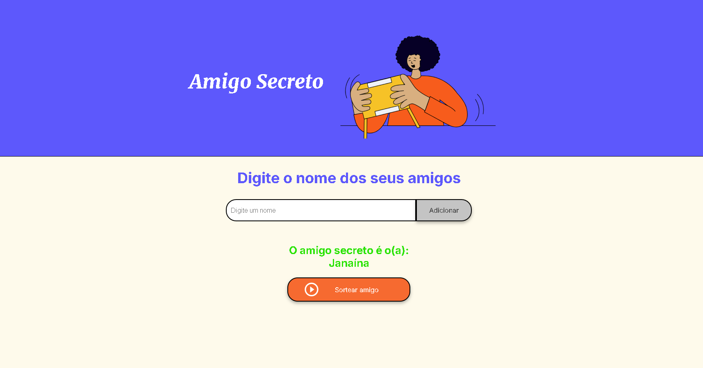

# 🎁 Amigo Secreto

Projeto desenvolvido como parte do **Challenge do Oracle Next Education**, com o objetivo de fortalecer habilidades em **JavaScript** através da implementação de um sistema de sorteio de amigo secreto.

## 📌 Funcionalidades

✅ Adicionar amigos à lista\
✅ Sortear um amigo secreto aleatoriamente\
✅ Remover o amigo sorteado da lista para novas rodadas\

## 🖥️ Tecnologias Utilizadas

- **HTML5** para estruturação da página
- **CSS3** para estilização e layout responsivo
- **JavaScript** para lógica do sorteio e manipulação do DOM

## 🚀 Como Executar o Projeto

Abra direto no github Pages
https://everton-developer.github.io/challenge-amigo-secreto/

ou siga o procedimento abaixo:

1. Faça o download ou clone este repositório:
   ```bash
   git clone https://github.com/seu-usuario/amigo-secreto.git
   ```
2. Acesse a pasta do projeto:
   ```bash
   cd amigo-secreto
   ```
3. Abra o arquivo `index.html` em um navegador.

## 📷 Demonstração




## 📌 Estrutura dos Arquivos

```
📂 amigo-secreto
│── index.html    # Estrutura principal do site  
│── style.css     # Estilização da interface  
│── app.js        # Lógica do sorteio e manipulação do DOM  
│── assets/       # Imagens e ícones utilizados  
```